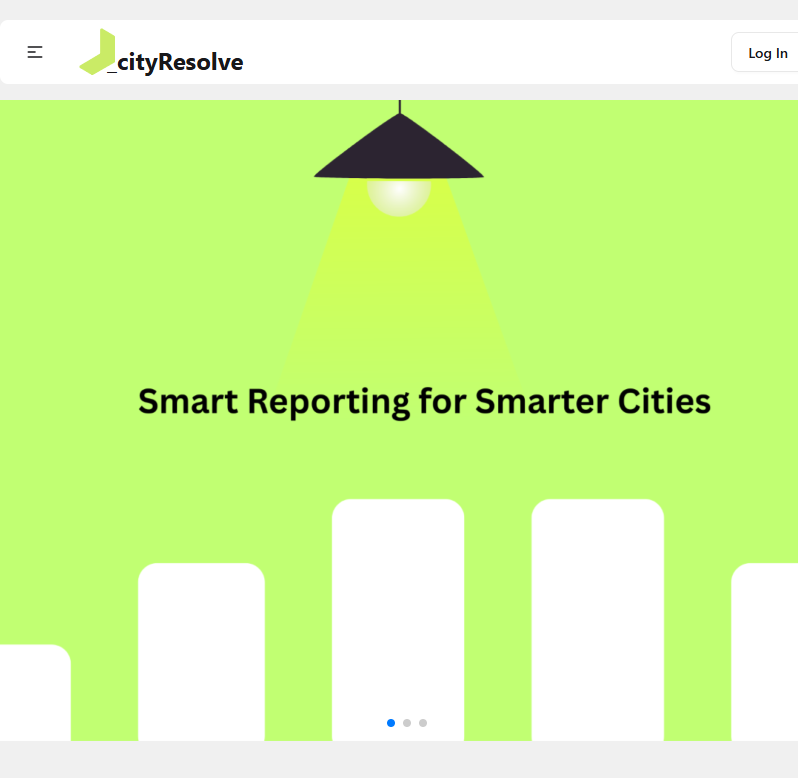
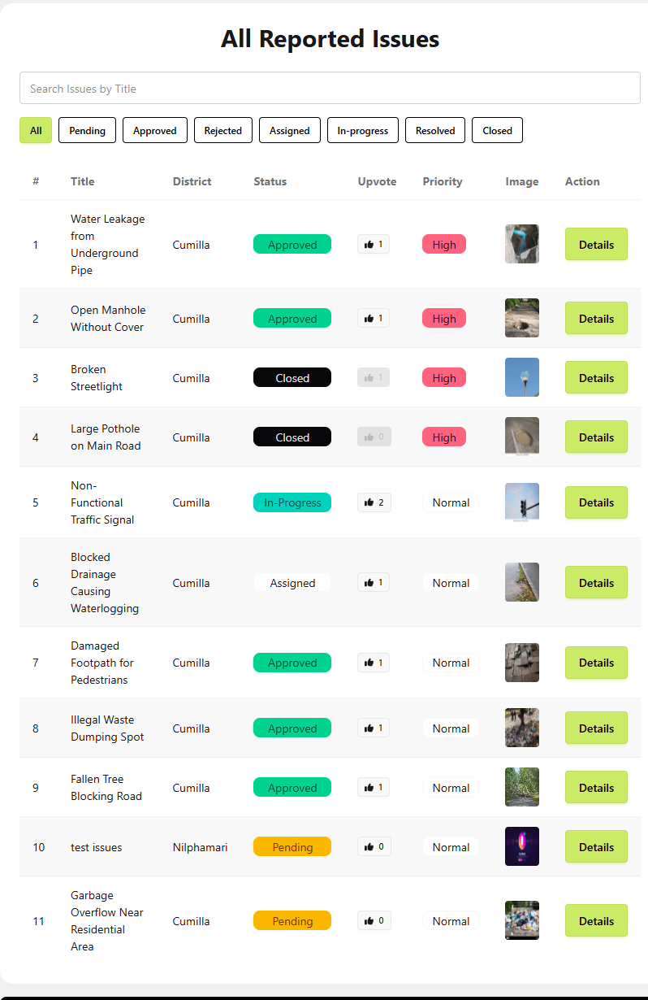
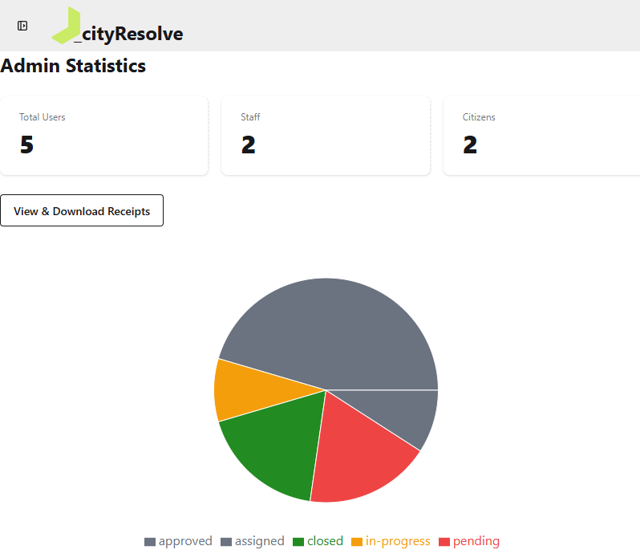

# 🏙️ cityResolve: The Public Infrastructure Issue Reporting System

# Live Link: https://city-resolve-client.web.app

## 📌 Project Overview

The cityResolve is a web-based platform that allows citizens to report public infrastructure problems such as broken streetlights, potholes, water leakage, garbage overflow, damaged footpaths, etc. The system ensures efficient communication between citizens, government staff, and administrators to track, manage, and resolve issues transparently.

This project aims to reduce delays, improve accountability, and provide a centralized digital solution for managing public infrastructure complaints.

## 🖼️ Project Screenshot

## 🎯 Key Objectives

- Provide a centralized platform for reporting public issues

- Improve response time from authorities

- Ensure transparency and accountability

- Digitally track issue status from report to closure

## 👥 User Roles

- Citizen

- Staff

- Admin

## 🔹 Features

### 👤 Citizen Features

- Register and log in securely

- Report public infrastructure issues with details

- Upload images for better clarity

- Track issue status using a unique tracking ID

- View issue history and updates

### 🛠️ Staff Features

- View issues assigned by admin

- Mark issues as resolved after completing work

- See real-time status updates

### 🛡️ Admin Features

- View all reported issues
- Verify reported issues
- Assign issues to staff members
- **Assign issues only to staff members from the same district as the reported issue**
- Close issues after staff resolution
- Manage users (promote/demote admin, block/unblock users)
- Track overall system statistics via dashboard

## 📊 Dashboards

### Admin Dashboard

- Total users

- Total issues

- Issue status analytics

### Staff Dashboard

- Assigned issues

- Issue progress

### Citizen Dashboard

- Submitted issues

- Status tracking

## 🔄 Issue Workflow

- Citizen reports an issue

- **Admin assigns the issue to an available staff member from the same district**

- Staff resolves the issue

- Admin reviews and closes the issue

## 🔐 Security & Access Control

- JWT-based authentication

- Role-based authorization (Citizen / Staff / Admin)

- Admin-only protected routes

- Blocked users are restricted from system access

## 🧰 Technology Stack

- Frontend: React, Tailwind CSS, DaisyUI

- Backend: Node.js, Express.js

- Database: MongoDB
